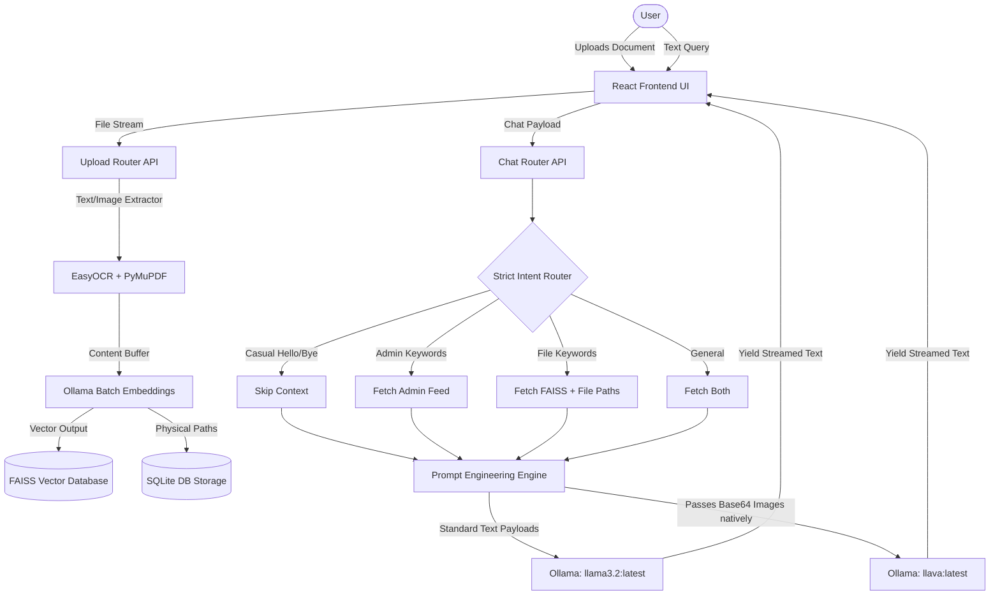
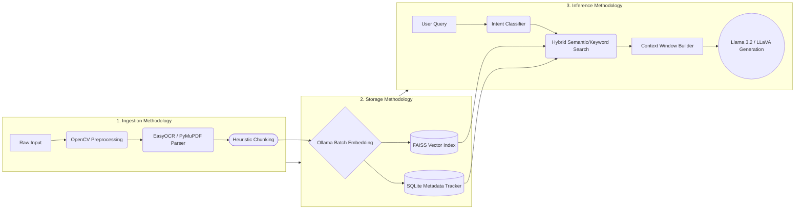
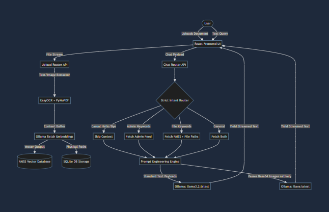

# RELEX AI - Enterprise Chatbot Platform

RELEX AI is a highly advanced, enterprise-grade chatbot system featuring intelligent context-awareness, dynamic retrieval augmented generation (RAG), and native multimodal vision capabilities.

## Problem Statement

Modern enterprises face significant challenges in managing unstructured data, leading to fragmented knowledge silos spread across PDFs, Excel sheets, images, and static HR feeds. Existing chatbot solutions frequently fail to provide secure context boundaries—allowing sensitive administrative datasets to leak into general queries—and lack the native multimodal vision capabilities required to intelligently understand charts, graphs, and scanned documents.

RELEX AI fundamentally solves this by providing a unified, localized, AI-native RAG pipeline. It strictly isolates query intent via a specialized routing mechanism, secures enterprise data natively, and leverages Vision LLMs (like `llava`) to literally "see", cross-reference, and reason over uploaded visual documentation without manual extraction.

---

## Architecture Flow Diagram



---

## Methodologies

RELEX AI employs a systematic, multi-step methodology to ensure seamless enterprise data ingestion and secure inference:

1. **Data Ingestion & Optical Preprocessing**: Uploaded visual files undergo robust preprocessing. Images are passed through an OpenCV pipeline (Grayscale conversion, Median Blur, Adaptive Gaussian Thresholding) to normalize varying illumination and noise before hitting the EasyOCR extraction engine.
2. **Batch Embedding Standardization**: Textual data is mathematically mapped into vectors. Instead of sequential requests, RELEX AI uses a dynamic Batch Embedding array to process hundreds of chunks in a single network transmission, eliminating latency bottlenecks.
3. **Hybrid RAG Semantic Retrieval**: User queries are embedded and compared against the FAISS vector database. A secondary reranking algorithm scores results based on exact keyword overlap, table detection metrics, and content length to bubble up the most relevant data.
4. **Intent Isolation Protocol**: Strict algorithmic routing enforces domain isolation. It prevents document-related queries from accessing protected HR administrative data feeds, and vice versa.
5. **Multimodal Payload Parsing**: When physical images trigger mathematical retrieval, the original raw image byte stream is securely fetched, converted to Base-64, and attached synchronously to the text query. This allows native vision models to cross-verify visual elements beyond the capabilities of pure OCR.

### Methodologies Flow Diagram



---

## Architecture & Tech Stack

- **Backend**: FastAPI (Python)
- **Database**: SQLite (Structured data & Document Metadata) + FAISS (Vector Embeddings)
- **Frontend**: React + Vite (Custom glassmorphic, cinematic premium UI)
- **AI / LLM Engine**: 
  - Local Ollama running `llama3.2:latest` for text logic and reasoning.
  - Local Ollama running `llava:latest` for multimodal vision logic.
  - Local Embeddings using `nomic-embed-text:latest`
- **OCR Engine**: EasyOCR integrated natively with OpenCV for thresholding and noise removal.

---

## Core Features & Workflows

### 1. Intelligent Intent Routing Pipeline
RELEX AI dynamically classifies user input using a secure, lightning-fast regex detection system to ensure data boundaries are strictly maintained.
- **Casual Intent**: General greetings bypass the RAG engine completely, saving processing power and executing directly on the LLM.
- **Administrative Intent**: Employee questions specifically query the `AdminFeed` database to look up official broadcasted metrics or HR announcements.
- **Document Intent**: Interrogates uploaded files directly based on FAISS embeddings. 
- **Strict Context Isolation**: Prevents document hallucinations from polluting administrative queries and vice versa.

### 2. Multi-modal Native Vision Retrieval
RELEX AI boasts an industry-leading multimodal vision process. 
When a user uploads an image (JPG, PNG) or Scanned Document:
- The system extracts text using OpenCV and EasyOCR to feed the mathematical embeddings.
- It concurrently persists the **absolute physical server path** of the image in the SQL index.
- Upon retrieval, the frontend UI instantly streams the image directly into the chat bubble for a zero-latency UX.
- The backend natively wraps the pure image bytestream in `base64` format and silently intercepts the standard LLM, routing the query and image straight into `llava:latest` to grant the AI true 20/20 vision of the document.

### 3. Asynchronous Batch Vector Encoding
Unlike typical local solutions that loop single API calls, RELEX AI's `upload_router` chunks massively long datasets (PDFs, Excel, Docs) into 700-character matrices and executes a single concurrent **Batch Embedding** network call to the Ollama API, reducing massive latency bottlenecks from minutes down to a few seconds.

### 4. Advanced PDF Parsing
- System natively handles standard text PDFs (`pypdf`).
- Incorporates dynamic fallback scanning via `PyMuPDF (fitz)` directly into the EasyOCR pipeline for scanned, image-based PDF layouts.

### 5. "ChatGPT-Style" Streaming UI
- Frontend requests utilize `ReadableStream` standards to pipe generated tokens synchronously to the DOM.
- Implements bespoke custom CSS indicators (`.typing-indicator` with bounce animations) dynamically mounted *only* while inference is locking the `llava` engine block.
- Trailed by a smooth, solid generation cursor mimicking leading AI enterprise platforms.

---

## Deployment & Running Locally

### Backend Server
1. Navigate to `\backend`
2. Activate Virtual Environment: `.\venv\Scripts\Activate.ps1`
3. Launch Server: `uvicorn main:app --reload`

### Frontend Client
1. Navigate to `\frontend`
2. Launch React scripts: `npm start`

### Ollama Subsystem
Ensure your Ollama system runs locally in the background. If downloading on a fresh system, install required packages:
```bash
ollama run llama3.2
ollama run llava
ollama pull nomic-embed-text
```

---

*RELEX AI sets the standard for localized enterprise AI agents, ensuring absolute privacy, speed, and intelligence.*
